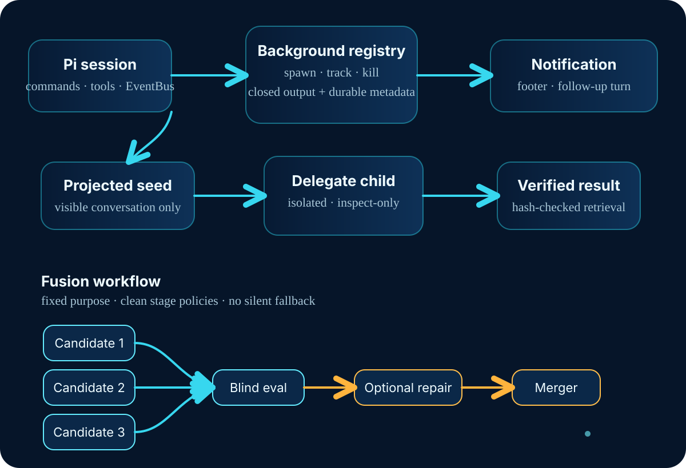
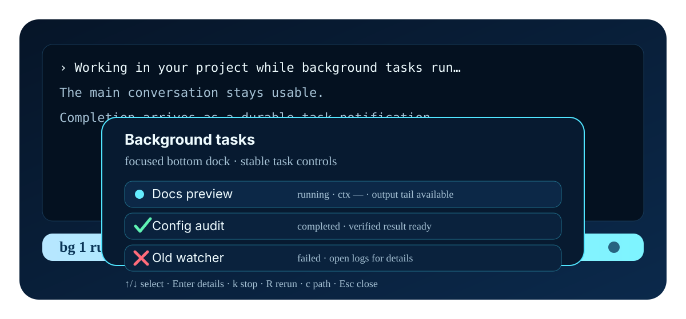

<div align="center">
  

# prime-background-tasks

**Keep Prime Agent moving while long shell jobs run in the background, and get woken when they finish.**

[](https://github.com/earendil-works/pi-coding-agent)
[](package.json)
[](LICENSE)

</div>

`prime-background-tasks` adds background jobs, delegated agents, and multi-model Fusion for Pi:

- **Run long work without blocking**: start named shell jobs, keep talking to Pi, and get durable completion notifications when they finish.
- **Delegate context-aware investigation**: launch one route-pinned, inspect-only child Pi agent seeded with a frozen projection of the current conversation, then retrieve a hash-verified result.
- **Combine model perspectives through fixed-purpose Fusion**: run three candidate children, blind evaluation, optional bounded evaluator repair, and merger for reasoning, investigation, targeted URL research, or validation review.
- **Keep Anthropic subscription traffic attributed and compatible**: globally apply the package-owned Claude Code OAuth attribution, cache policy, and exact-match prompt sanitization to Anthropic routes without an external sanitizer dependency.

<p align="center">
  
</p>

<!-- pi-docs:begin name="readme-package-facts" generator="scripts/docs/generate.mjs" -->
| Fact | Value |
| --- | --- |
| Package | `prime-background-tasks` |
| Version | `1.0.0` |
| Node engine | `>=22.19.0` |
| Pi entrypoints | `./extensions/background-tasks.ts` |
| Package image | [logo.png](https://raw.githubusercontent.com/tickernelz/prime-background-tasks/main/logo.png) |
<!-- pi-docs:end name="readme-package-facts" -->

<!-- pi-docs:begin name="readme-public-surfaces" generator="scripts/docs/generate.mjs" -->
| Surface kind | Count |
| --- | --- |
| command | 8 |
| tool | 4 |
| shortcut | 2 |
| renderer | 1 |
| eventbus | 1 |
| workflow | 0 |

Public commands: `/bg`, `/bg-clear`, `/bg-logs`, `/bg-tasks`, `/bg-update`, `/jobs`, `/kill`, `/tasks`.

Public tools: `bg_kill`, `bg_logs`, `bg_run`, `bg_status`.

Full owner map and generated contracts live in [docs/INDEX.md](docs/INDEX.md).
<!-- pi-docs:end name="readme-public-surfaces" -->


## Why use it?

| You want to... | Use this package because... |
|---|---|
| Start a dev server, watch build, migration dry run, or long check | `bg_run` and `/bg` return immediately, write durable output files, show a footer dock, and notify on terminal state. |
| Let Pi keep working instead of sleeping or polling | Default `bg_run` completion delivery sends a durable terminal notification and can wake a follow-up turn. |
| Ask a second agent to inspect the repo with the current conversation as context | `bg_delegate` starts one read/search/list child, isolated from ambient extensions by default; `bg_result` verifies the committed result before returning it. |
| Compare model perspectives without exposing arbitrary parent context | Fusion children receive only the workflow input and fixed tool policy; no silent route substitution or fallback is used on delegate/Fusion paths. |
| Produce local evidence for a direct Pi run | `bg_run_pi_attested` records local same-user-writable artifacts and hashes after a successful structured child Pi task. |
| Use Anthropic subscription OAuth consistently | The globally loaded provider applies attribution and exact-match sanitization; `/claude-cache` shows or changes session cache retention. |

## Install

Version information comes from [`package.json`](package.json). Use npm `@latest` for normal installs; use git `main` only when you intentionally want the current repository state.

```bash
# Global install from npm
pi install npm:prime-background-tasks@latest

# Project-local install from npm
pi install npm:prime-background-tasks@latest -l

# Git main branch; not a release tag
pi install git:github.com/tickernelz/prime-background-tasks@main

# Project-local git main install
pi install git:github.com/tickernelz/prime-background-tasks@main -l

# Local checkout/package path, run from this package directory
pi install .
pi install . -l
```

Local paths are loaded from disk without copying; use the path to this package from your current directory.

## Quick start: useful in under five minutes

1. Install and start Pi in a project.
2. Launch a background command:

   ```text
   /bg --name "Typecheck watch" npm run typecheck -- --watch
   ```

   `/bg` starts a tracked shell task and returns the task id plus output path. User-launched `/bg` tasks notify in the UI but do not automatically wake a follow-up model turn.

3. Open the footer dock with **Shift↓** or list tasks:

   ```text
   /jobs
   ```

4. Read bounded output only when you need it:

   ```text
   /logs b12ab34c 20000
   ```

5. Let a child agent inspect while you continue:

   ```json
   {"name":"Config reader","prompt":"Inspect the repository configuration files and report where background task settings are documented. Include file paths and quote only the relevant lines.","capability":"inspect"}
   ```

   Call this with `bg_delegate`. When its terminal notification arrives, retrieve the answer deliberately:

   ```json
   {"taskId":"<task id from bg_delegate>","delivery":"inline"}
   ```

   Call this with `bg_result`. Retrieval is hash-verified and never silently truncated.

6. For a self-contained synthesis, start Fusion in the background:

   ```json
   {"prompt":"Compare the tradeoffs between a watcher, a one-shot build, and a delegated repo inspection for a large refactor."}
   ```

   Call this with `fusion_reason`, or use `/fusion <prompt>` interactively. The launch returns after durable preflight; wait for its terminal notification, then retrieve the verified result with `bg_result`.

More walkthrough detail: [Getting started](docs/getting-started.md).

## Pick the right workflow

| Workflow | Blocking? | Context | Tools/network/write boundary | Best for | Expected behavior |
|---|---:|---|---|---|---|
| Ordinary foreground Pi work | Yes | Full current session | Whatever tools the active session has | Short reads/edits/commands where you want live back-and-forth | Pi waits for the work before responding. |
| `/bg` | No | No model child unless your command starts one | Runs your shell command; **not sandboxed** | User-started local commands, servers, watches | UI notification and footer tracking; `/bg` uses notification-only by default. |
| `bg_run` | No | No model child unless command starts one | Runs your shell command; **not sandboxed** | Agent-started long commands | Returns task id/output path; defaults to notification plus automatic follow-up wake. For an Anthropic child `pi`, do not pass `--no-extensions` unless you also explicitly load this package's attribution extension. |
| `bg_delegate` + `bg_result` | No launch; retrieval is point-in-time | Frozen visible conversation projection | Inspect-only child: read, grep, find, ls, artifact read; no shell, writes, network, recursion | Context-aware read-only investigation while parent continues | Launch returns immediately; result is committed by child and hash-verified by retrieval. |
| `bg_run_pi_attested` | No | Prompt passed to one direct child Pi run | Direct `pi --mode json`; no shell command; writes requested report path | Evidence-oriented direct Pi task | Emits local attestation sidecar only after successful completion. |
| `/fusion` / `fusion_reason` | Background launch; point-in-time `bg_result` retrieval | Versioned conversation projection plus prompt | Candidates/evaluator/repair/merger run with no tools | Self-contained reasoning and synthesis | Returns after durable preflight; three candidates → blind evaluator → optional bounded repair → merger. |
| `fusion_investigate` | Background launch; point-in-time `bg_result` retrieval | Clean task input only | Candidate read-only repo tools; evaluator/repair/merger no tools | Independent repo investigation | Restate needed facts; continue only independent work while the live repository is inspected. |
| `fusion_research` | Background launch; point-in-time `bg_result` retrieval | Clean task input only | Candidate read-only repo tools plus targeted fetch of caller-supplied public URLs only | URL-backed synthesis | Targeted URL retrieval, **not web search**. |
| `fusion_validate` | Background launch; point-in-time `bg_result` retrieval | Clean task input only | Advisory read-only validation review | Second-opinion review of completed work | Do not mutate the reviewed scope while it runs; not a substitute for mechanical gates. |

See [Choose a workflow](docs/choose-a-workflow.md) for a decision tree and tradeoffs.

## Copy-paste examples

### `bg_run`: start long shell work

```json
{
  "name": "Docs preview",
  "command": "npm run docs:dev",
  "isAgent": false,
  "timeoutSeconds": 3600
}
```

Expected: returns immediately with a task id, PID when available, and `.pi/tasks/...output`. The command runs as an ordinary local shell command with your user permissions; it can invoke networked tools or paid services if the command itself does so.

If `bg_run` starts an Anthropic child `pi`, keep normal extension discovery enabled. Do not add `--no-extensions` unless the command also supplies this package's `extensions/anthropic-attribution.ts` via `-e`/`--extension`; `bg_run` does not rewrite arbitrary shell argv.

### `bg_delegate`: context-seeded read-only investigation

```json
{
  "name": "Route audit",
  "prompt": "Inspect the package source and identify where delegate route pinning is enforced. Return file paths, function names, and a short explanation. If a fact exists only in omitted parent tool output, say it is unavailable rather than guessing.",
  "capability": "inspect",
  "extensionMode": "isolated",
  "autoDeliver": "never"
}
```

Then retrieve:

```json
{
  "taskId": "<delegate task id>",
  "delivery": "inline"
}
```

Expected: `bg_delegate` returns a launch receipt immediately. `bg_result` returns a typed not-ready result while running; after commit it verifies package identity, seed hash, route, block hashes, and aggregate hash before returning bytes. Oversized answers become explicit artifact references, not truncated inline text.

`extensionMode` defaults to `"isolated"`, which disables ambient extension discovery. If the pinned provider exists only because a user/project Pi extension registers it, opt into `"ambient"`. Ambient mode still loads the delegate guard and keeps the inspect tool allowlist plus skill/template/theme/context restrictions, but it executes arbitrary discovered extension code. Tool allowlists do not sandbox that code, so ambient mode weakens inspect-only process isolation. The call never accepts extension paths and never substitutes the pinned route.

### `bg_run_pi_attested`: local evidence for one Pi child

```json
{
  "name": "Migration report",
  "provider": "openai-codex",
  "model": "gpt-5.5",
  "prompt": "Inspect the repository and write a concise migration report to reports/migration.md.",
  "reportPath": "reports/migration.md",
  "timeoutSeconds": 1800
}
```

Expected: launches exactly one direct `pi --mode json` child using structured provider/model fields. It rejects direct API-key/auth-file launch arguments and only writes the attestation sidecar after successful completion and durable hashes. The attestation is local evidence, not cryptographic proof against a compromised machine or provider.

### Fusion tools

```json
{"prompt":"Design a rollback strategy for a risky database migration. Include assumptions and failure modes."}
```

Use with `fusion_reason` for self-contained synthesis.

```json
{
  "objective": "Find how background task output is capped and surfaced.",
  "background": ["We are evaluating prime-background-tasks behavior for long-running commands."],
  "deliverable": "File paths, constants, defaults, and user-visible behavior.",
  "scope": ["src"],
  "constraints": ["Read-only inspection only."]
}
```

Use with `fusion_investigate`.

```json
{
  "objective": "Summarize the installation syntax Pi documents for packages.",
  "background": ["We need package README install examples to match Pi package docs."],
  "deliverable": "A short summary with caveats.",
  "sources": [
    {"url":"https://github.com/earendil-works/pi-coding-agent","purpose":"Pi package documentation repository"}
  ]
}
```

Use with `fusion_research`. Only declared public `http(s)` URLs may be fetched; this is not a search tool.

```json
{
  "objective": "Review whether a documentation-only change is ready to ship.",
  "background": ["The change edits README and package-local docs only."],
  "changeSummary": "Replaced monolithic README with landing page and moved operational details into docs.",
  "scope": ["README.md", "docs/getting-started.md", "docs/choose-a-workflow.md"],
  "acceptanceCriteria": ["Install commands are accurate", "Safety limitations are explicit", "Examples match public schemas"],
  "verification": {
    "status": "provided",
    "evidence": [{"check":"Focused link check", "outcome":"All local README links resolve"}]
  }
}
```

Use with `fusion_validate` for advisory read-only review.

## Footer dock

<p align="center">
  
</p>

When tasks are running or unseen completions exist, the footer shows a compact `bg ...` segment. Press **Shift↓** to open the focused bottom dock. Use `/bg-clear` to acknowledge finished-task footer notices in any terminal.

| Control | Action |
|---|---|
| `Shift↓` | Open the dock |
| `/bg-clear` | Clear finished-task notices |
| `↑` / `↓`, `PageUp` / `PageDown` | Move through list or scroll output tail |
| `Enter` / `→` | Inspect details |
| `←` | Return to list |
| `k` | Stop selected running task |
| `R` | Rerun selected command |
| `c` | Show copyable output path |
| `x` / `Esc` / `q` | Close dock |

Agent tasks launched through `pi -p ...` or `pi --mode json ...` and marked `isAgent:true` can show task-owned model/context/token/tool telemetry. Missing child telemetry is shown as unavailable, not synthesized as zero.

<a id="commands"></a>
<a id="footer-dock-ux"></a>
<a id="update-available-notice"></a>
<a id="llm-tools"></a>
<a id="delegated-background-agents"></a>
<a id="fusion-workflow"></a>
<a id="conversation-context-policy"></a>
<a id="extension-eventbus-api"></a>
<a id="runtime-files"></a>
<a id="durability-model"></a>
<a id="safety-model"></a>
<a id="windows-shell-and-telemetry"></a>

## Architecture, trust, and safety

- Runtime task files live under `.pi/tasks/<session-id>-<pid>/`; Fusion artifacts under `.pi/fusion/...`; delegate artifacts under `.pi/delegate/...`.
- Delegate launch budgeting uses backed route-family calibration for eligible large prompts and records a provable conservative counter-forecast across every byte class. During investigation, text and image-bearing tool output spill losslessly when retaining them would consume protected final-answer runway—even below the normal 64 KiB per-result threshold. Exact artifact ranges return as base64, final capture excludes intermediate tool-use narration, and near the runway boundary tools are disabled for graceful finalization. Runtime token estimates are advisory; Pi/provider own live context admission, avoiding Fusion BUG-185-style false refusals.
- Shell jobs are tracked by the package, but they are not sandboxed. Treat commands as local processes with your permissions and credentials.
- Delegate and Fusion child Pi processes are route-pinned where applicable; delegate/Fusion paths do not silently substitute routes.
- Fusion uses direct child `pi --mode text` processes, not direct completion APIs. Frontier Fusion routes are admitted only through Pi Anthropic or Codex subscription OAuth; metered frontier API credentials are rejected before child creation.
- Normal installations globally load the package-owned Claude Code OAuth attribution/sanitization provider for Anthropic sessions; non-Anthropic sessions are unchanged. Isolated Fusion, delegate, and attested Anthropic children load the same package entrypoint explicitly. It requests `ttl: "1h"` on system/tool/conversation cache breakpoints before serialization and preserves provider-reported `cacheWrite1h` evidence. Set `PI_CACHE_RETENTION=short|none|long` or use `/claude-cache` to choose explicitly; malformed attribution, policy, cache evidence, or non-OAuth credentials fail before transport. Provider usage is preserved verbatim, but subscription OAuth can report `cacheWrite1h = 0` even when a unique cache remains readable beyond five minutes; treat positive `cacheWrite1h` as definitive and zero as inconclusive on that channel. Anthropic budgeting follows the provider's 200K subscription policy.
- Fusion research fetches only caller-supplied public `http(s)` URLs with bounded retrieval. It is not web search and not a secret-exfiltration boundary.
- Attestation sidecars are local, unsigned, same-user-writable evidence. They are useful for downstream local gates, but not cryptographic proof against local compromise, a compromised Pi binary, or a compromised provider.
- Metadata, attestations, delegate/Fusion artifacts, and configuration replacements use write/fsync/rename durability patterns. Failed/cancelled stored Fusion runs also have a manifest-bound `failure-summary.json` containing bounded no-answer evidence metadata and artifact refs only; `bg_result` returns it as an answer-free typed terminal view after integrity checks. Ordinary task output is closed and drained before terminal publication but is not explicitly fsynced. POSIX directory entries are fsynced after atomic replacement; Windows lacks the same portable directory-entry crash-durability guarantee.

Detailed operations: [Configuration](docs/operations/configuration.md).

## EventBus and Autopilot integration

Other Pi extensions can control the same `BackgroundTaskRegistry` through Pi's `events` bus instead of shelling out or maintaining a second task manager. The public channels are:

| Purpose | Channel |
|---|---|
| Request | `prime-background-tasks:request:v1` |
| Response | `prime-background-tasks:response:v1` |
| Terminal task event | `prime-background-tasks:terminal:v1` |

Operations are `capabilities`, `run`, `status`, `logs`, and `kill`. This is the integration point for orchestrators such as Autopilot that need non-blocking package-managed work with bounded logs and correlated terminal events. Consumers must deduplicate terminal frames by `task.id`: an EventBus listener failure can cause a retried publication.

## Documentation map

| Need | Read |
|---|---|
| First install and first task | [Getting started](docs/getting-started.md) |
| Which workflow/tool to choose | [Choose a workflow](docs/choose-a-workflow.md) |
| Environment variables, shells, output caps, model config, offline behavior | [Configuration](docs/operations/configuration.md) |
| Package QA expectations | [TESTING.md](TESTING.md) and [TEST_PLAN.md](TEST_PLAN.md) |
| Publishing notes | [PUBLISHING.md](PUBLISHING.md) |
| License and derived-rule notice | [LICENSE](LICENSE) and [THIRD_PARTY_NOTICES.md](THIRD_PARTY_NOTICES.md) |

## Contributing

Keep user-facing claims tied to source. If you change public schemas, command behavior, durability, model routing, or environment variables, update these package-local docs in the same change and run focused checks appropriate to the edit.
